# X402 Architecture Documentation

> **Version:** 1.0.0  
> **Last Updated:** January 2026  
> **Author:** X402 Protocol Team

## Table of Contents

1. [System Overview](#system-overview)
2. [Component Deep Dives](#component-deep-dives)
3. [Security Model](#security-model)
4. [Design Decisions](#design-decisions)
5. [Scalability Considerations](#scalability-considerations)

---

## System Overview

X402 is a comprehensive payment protocol implementation for AI agents, enabling micropayments using the HTTP 402 (Payment Required) standard with yield-bearing USDs stablecoin on Arbitrum.

### High-Level Architecture

```
┌─────────────────────────────────────────────────────────────────────────────────────────┐
│                                    X402 PROTOCOL                                         │
├─────────────────────────────────────────────────────────────────────────────────────────┤
│                                                                                          │
│   ┌──────────────┐         HTTP 402          ┌──────────────────┐                       │
│   │              │◄──────────────────────────│                  │                       │
│   │   AI Agent   │      Payment Required     │    API Server    │                       │
│   │   (Payer)    │                           │    (Paywall)     │                       │
│   │              │──────────────────────────►│                  │                       │
│   └──────┬───────┘      X-Payment Header     └────────┬─────────┘                       │
│          │                                            │                                  │
│          │ EIP-3009                                   │ Verify                           │
│          │ Authorization                              │ Payment                          │
│          │                                            │                                  │
│          ▼                                            ▼                                  │
│   ┌──────────────────────────────────────────────────────────────┐                      │
│   │                     FACILITATOR SERVER                        │                      │
│   │  ┌─────────────┐ ┌─────────────┐ ┌─────────────┐            │                      │
│   │  │   /quote    │ │   /verify   │ │   /settle   │            │                      │
│   │  │  Generate   │ │   On-chain  │ │  EIP-3009   │            │                      │
│   │  │  402 Info   │ │   Check     │ │  Execute    │            │                      │
│   │  └─────────────┘ └─────────────┘ └─────────────┘            │                      │
│   │                        │                │                    │                      │
│   │                        └───────┬────────┘                    │                      │
│   │                                │                             │                      │
│   │                    ┌───────────┴───────────┐                 │                      │
│   │                    │    Payment Cache      │                 │                      │
│   │                    │    (LRU + TTL)        │                 │                      │
│   │                    └───────────────────────┘                 │                      │
│   └──────────────────────────────┬───────────────────────────────┘                      │
│                                  │                                                       │
│                                  ▼                                                       │
│   ┌──────────────────────────────────────────────────────────────────────────────┐      │
│   │                           ARBITRUM L2 NETWORK                                 │      │
│   │                                                                               │      │
│   │  ┌───────────────┐  ┌────────────────┐  ┌────────────────┐  ┌─────────────┐ │      │
│   │  │  USDs Token   │  │ ToolRegistry   │  │ PaymentChannel │  │ Subscription│ │      │
│   │  │  (Rebasing)   │  │   (UUPS)       │  │    (UUPS)      │  │   (UUPS)    │ │      │
│   │  │               │  │                │  │                │  │             │ │      │
│   │  │ • EIP-3009    │  │ • Tool CRUD    │  │ • State Chs    │  │ • Recurring │ │      │
│   │  │ • Auto-Yield  │  │ • Pay-per-call │  │ • Disputes     │  │ • Deposits  │ │      │
│   │  │ • 8-25% APY   │  │ • Revenue      │  │ • Cooperative  │  │ • Keepers   │ │      │
│   │  └───────────────┘  └────────────────┘  └────────────────┘  └─────────────┘ │      │
│   │                                                                               │      │
│   │  ┌───────────────┐  ┌────────────────┐                                       │      │
│   │  │ CreditSystem  │  │RevenueSplitter │                                       │      │
│   │  │   (UUPS)      │  │                │                                       │      │
│   │  │               │  │                │                                       │      │
│   │  │ • Prepaid     │  │ • 80/20 Split  │                                       │      │
│   │  │ • Yield Earn  │  │ • Batch Pay    │                                       │      │
│   │  │ • Bonus       │  │ • Auto-yield   │                                       │      │
│   │  └───────────────┘  └────────────────┘                                       │      │
│   └──────────────────────────────────────────────────────────────────────────────┘      │
│                                                                                          │
└─────────────────────────────────────────────────────────────────────────────────────────┘
```

### Data Flow Diagrams

#### Standard Payment Flow

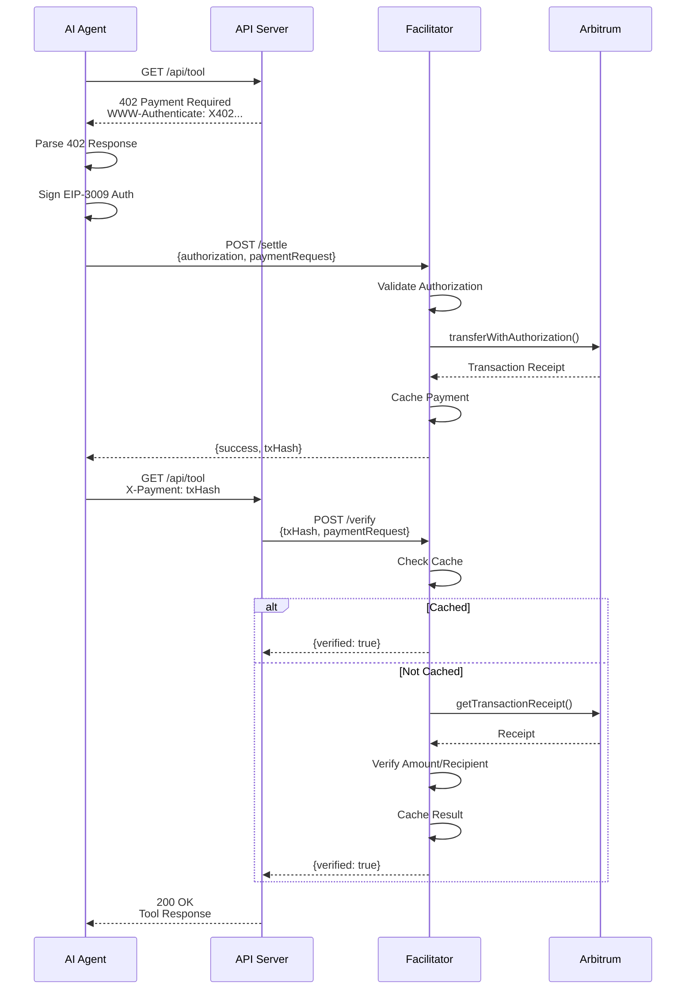

#### Payment Channel Flow (Streaming)

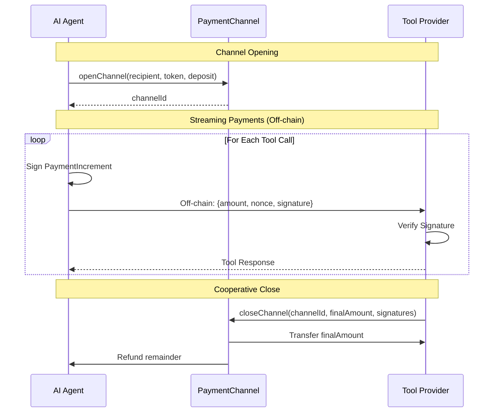

#### Subscription Flow

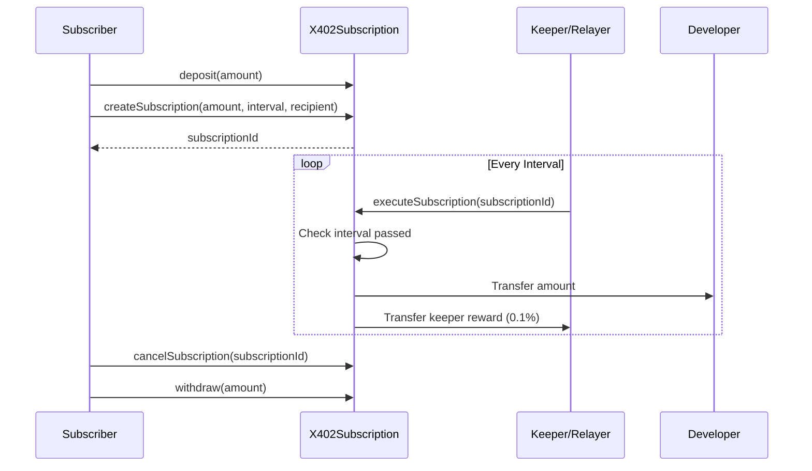

---

## Component Deep Dives

### SDK Architecture (`@x402/sdk`)

```
packages/sdk/
├── src/
│   ├── index.ts              # Public exports
│   ├── client.ts             # Main X402Client class
│   ├── types.ts              # Type definitions
│   ├── constants.ts          # Network configs, addresses
│   │
│   ├── payments/             # Payment strategies
│   │   ├── standard.ts       # Direct ERC-20 transfers
│   │   ├── gasless.ts        # EIP-3009 authorization
│   │   └── batch.ts          # Multiple payments
│   │
│   ├── http/                 # HTTP 402 handling
│   │   ├── handler.ts        # Parse/create 402 responses
│   │   └── middleware.ts     # Express/fetch middleware
│   │
│   ├── yield/                # USDs yield tracking
│   │   └── tracker.ts        # Balance & yield queries
│   │
│   └── contracts/            # Contract interfaces
│       ├── usds.ts           # USDs token
│       └── revenue-splitter.ts
```

#### Module Structure

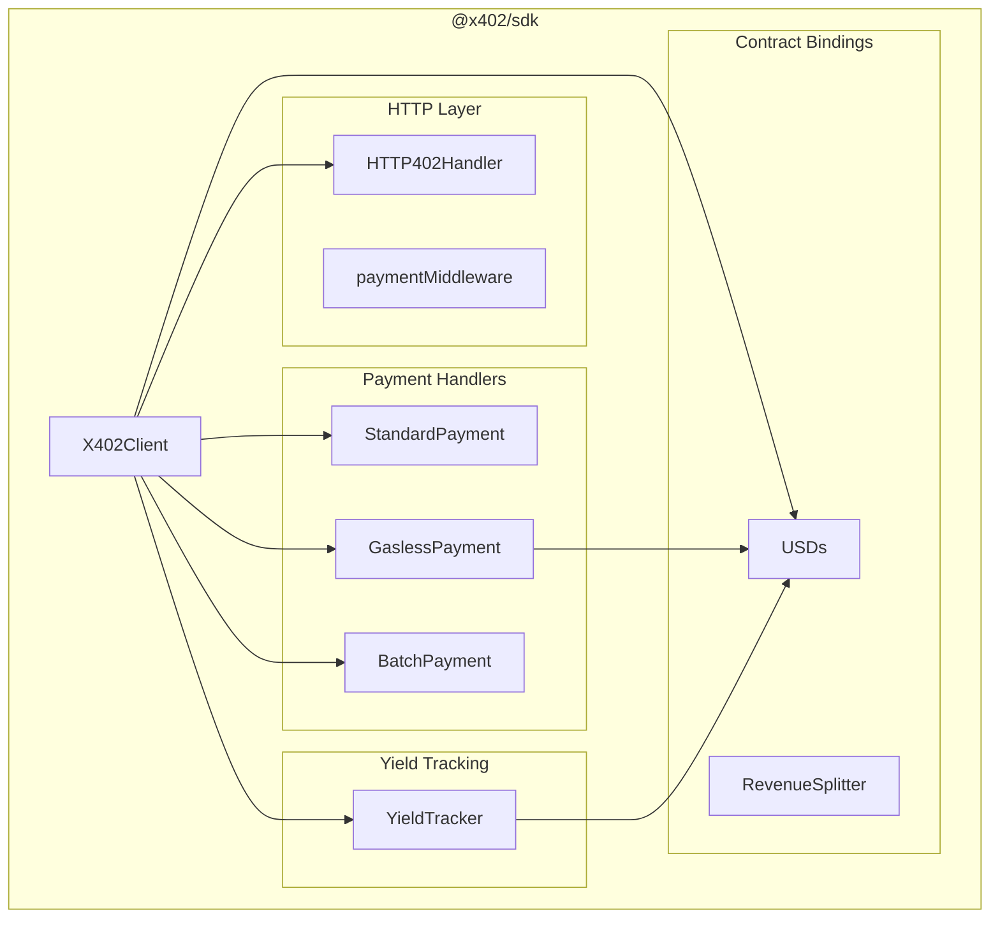

#### State Management

The SDK is stateless by design, with minimal client-side state:

```typescript
class X402Client {
  // Configuration (immutable after construction)
  private readonly publicClient: PublicClient;
  private readonly walletClient?: WalletClient;
  private readonly chain: X402Chain;
  
  // Payment handlers (lazy-initialized, stateless)
  private readonly standardPayment: StandardPayment;
  private readonly gaslessPayment: GaslessPayment;
  private readonly batchPayment: BatchPayment;
  
  // Event listeners (optional, for monitoring)
  private readonly listeners: Set<PaymentEventListener>;
}
```

#### Error Handling Strategy

```typescript
// Hierarchical error codes for programmatic handling
export enum X402ErrorCode {
  // Chain/Network errors (1xxx)
  UNSUPPORTED_CHAIN = 1001,
  RPC_ERROR = 1002,
  NETWORK_TIMEOUT = 1003,
  
  // Authentication errors (2xxx)
  MISSING_PRIVATE_KEY = 2001,
  INVALID_SIGNATURE = 2002,
  AUTHORIZATION_EXPIRED = 2003,
  AUTHORIZATION_NOT_YET_VALID = 2004,
  NONCE_ALREADY_USED = 2005,
  
  // Payment errors (3xxx)
  INSUFFICIENT_BALANCE = 3001,
  INSUFFICIENT_ALLOWANCE = 3002,
  PAYMENT_FAILED = 3003,
  UNSUPPORTED_TOKEN = 3004,
  
  // HTTP 402 errors (4xxx)
  INVALID_402_RESPONSE = 4001,
  MISSING_AUTH_HEADER = 4002,
  
  // Settlement errors (5xxx)
  VERIFICATION_FAILED = 5001,
  SETTLEMENT_FAILED = 5002,
}

// Error class with context
export class X402Error extends Error {
  constructor(
    message: string,
    public readonly code: X402ErrorCode,
    public readonly cause?: unknown
  ) {
    super(message);
    this.name = 'X402Error';
  }
}
```

#### Retry and Timeout Logic

```typescript
const DEFAULTS = {
  TIMEOUT: 30000,               // 30 seconds
  RETRY_ATTEMPTS: 3,
  RETRY_DELAY_MS: 1000,
  RETRY_BACKOFF_FACTOR: 2,
  AUTHORIZATION_VALIDITY: 300,  // 5 minutes
};

async function withRetry<T>(
  fn: () => Promise<T>,
  options: RetryOptions = {}
): Promise<T> {
  const maxAttempts = options.attempts ?? DEFAULTS.RETRY_ATTEMPTS;
  const baseDelay = options.delay ?? DEFAULTS.RETRY_DELAY_MS;
  
  for (let attempt = 1; attempt <= maxAttempts; attempt++) {
    try {
      return await fn();
    } catch (error) {
      if (attempt === maxAttempts || !isRetryable(error)) {
        throw error;
      }
      const delay = baseDelay * Math.pow(DEFAULTS.RETRY_BACKOFF_FACTOR, attempt - 1);
      await sleep(delay);
    }
  }
  throw new Error('Unreachable');
}
```

---

### Facilitator Service Architecture

```
facilitator/
├── src/
│   ├── server.ts             # Express app setup
│   ├── types.ts              # Type definitions
│   │
│   ├── routes/               # API endpoints
│   │   ├── quote.ts          # Generate 402 responses
│   │   ├── verify.ts         # Verify on-chain payments
│   │   ├── settle.ts         # Execute EIP-3009 settlements
│   │   └── payments.ts       # Payment status queries
│   │
│   ├── services/             # Business logic
│   │   ├── arbitrum.ts       # Viem client wrapper
│   │   ├── usds.ts           # USDs-specific operations
│   │   └── cache.ts          # LRU payment cache
│   │
│   └── middleware/           # Express middleware
│       ├── logger.ts         # Request/response logging
│       └── rateLimit.ts      # Rate limiting
```

#### Request Lifecycle

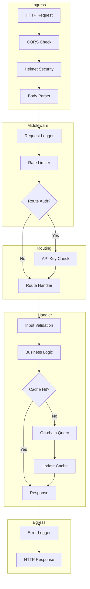

#### Validation Pipeline

```typescript
// Example: Settlement request validation
const validateSettleRequest = (body: Partial<SettleRequest>): SettleRequest => {
  // 1. Required fields
  if (!body.authorization) throw new ValidationError('MISSING_AUTHORIZATION');
  if (!body.paymentRequest) throw new ValidationError('MISSING_PAYMENT_REQUEST');
  
  // 2. Authorization structure
  const requiredAuthFields = ['from', 'to', 'value', 'validAfter', 'validBefore', 'nonce', 'v', 'r', 's'];
  const missing = requiredAuthFields.filter(f => body.authorization[f] === undefined);
  if (missing.length) throw new ValidationError('INVALID_AUTHORIZATION', { missing });
  
  // 3. Token support
  if (body.paymentRequest.token !== 'USDs') {
    throw new ValidationError('UNSUPPORTED_TOKEN');
  }
  
  // 4. Timing validation
  const now = Math.floor(Date.now() / 1000);
  if (now > body.authorization.validBefore) throw new ValidationError('AUTHORIZATION_EXPIRED');
  if (now < body.authorization.validAfter) throw new ValidationError('AUTHORIZATION_NOT_VALID_YET');
  
  return body as SettleRequest;
};
```

#### Caching Strategy

```typescript
interface CacheConfig {
  maxSize: number;      // Max items (default: 10,000)
  ttlMs: number;        // Time-to-live (default: 24 hours)
}

class PaymentCache {
  private cache: LRUCache<string, CachedPayment>;
  
  constructor(config: Partial<CacheConfig> = {}) {
    this.cache = new LRUCache({
      max: config.maxSize ?? 10000,
      ttl: config.ttlMs ?? 24 * 60 * 60 * 1000,
      updateAgeOnGet: true,   // Refresh TTL on access
      updateAgeOnHas: true,
    });
  }
  
  // Cache structure
  interface CachedPayment {
    txHash: string;
    verified: boolean;
    settled: boolean;
    amount: string;
    token: PaymentToken;
    from?: Address;
    to: Address;
    timestamp: number;
    blockNumber?: number;
    ttl: number;
  }
}
```

#### Security Measures

| Layer | Measure | Implementation |
|-------|---------|----------------|
| Transport | HTTPS | TLS termination at load balancer |
| Headers | Helmet.js | CSP, HSTS, X-Frame-Options |
| CORS | Whitelist | Configurable origin whitelist |
| Rate Limiting | Token bucket | 100 req/min (global), 10/min (settle) |
| Input | Validation | Zod schemas, address format checks |
| DoS | Payload limits | 1MB JSON body limit |
| Logging | Audit trail | Request ID, timestamps, outcomes |

---

### Smart Contract Architecture

#### Contract Inheritance Diagram

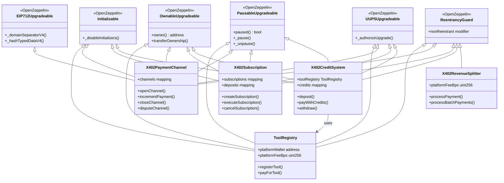

#### Storage Layout

All upgradeable contracts follow OpenZeppelin's storage layout patterns with explicit gaps:

```solidity
contract ToolRegistry {
    // Slot 0-49: OpenZeppelin upgradeable base contracts
    
    // Slot 50: platformWallet
    address public platformWallet;
    
    // Slot 51: platformFeeBps
    uint256 public platformFeeBps;
    
    // Slot 52: _tools mapping root
    mapping(bytes32 => ToolInfo) private _tools;
    
    // Slot 53: _toolNames mapping root
    mapping(bytes32 => string) private _toolNames;
    
    // Slot 54: _developerTools mapping root
    mapping(address => bytes32[]) private _developerTools;
    
    // Slot 55: totalTools
    uint256 public totalTools;
    
    // Slot 56: supportedTokens mapping root
    mapping(address => bool) public supportedTokens;
    
    // Slots 57-100: Storage gap for future upgrades
    uint256[44] private __gap;
}
```

#### UUPS Upgrade Pattern

```solidity
// Only owner can authorize upgrades
function _authorizeUpgrade(address newImplementation) 
    internal 
    override 
    onlyOwner 
{
    // Additional validation can be added here
    // e.g., timelock, multisig requirement
}

// Upgrade process:
// 1. Deploy new implementation
// 2. Call upgradeToAndCall(newImpl, data) on proxy
// 3. Proxy delegates to new implementation
```

#### Access Control Model

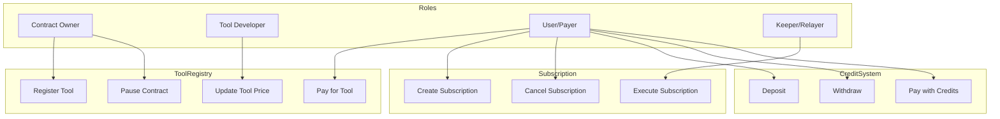

#### Emergency Procedures

```solidity
// 1. Pause all operations
function pause() external onlyOwner {
    _pause();
    emit EmergencyPaused(msg.sender, block.timestamp);
}

// 2. Emergency withdrawal (owner only, when paused)
function emergencyWithdraw(address token, uint256 amount) 
    external 
    onlyOwner 
    whenPaused 
{
    IERC20(token).safeTransfer(owner(), amount);
    emit EmergencyWithdrawal(token, amount);
}

// 3. Channel dispute resolution
function resolveDispute(bytes32 channelId, uint256 amount)
    external
    onlyOwner
{
    // Manual dispute resolution as last resort
}
```

---

### MCP Server Architecture

The Model Context Protocol (MCP) server enables AI assistants to interact with X402 payments.

```
sperax/
├── index.ts              # Package exports
├── services/
│   └── sperax.ts         # Sperax USDs client
└── tools/
    ├── x402-tools.ts     # Tool definitions & handlers
    └── mcp-server.ts     # Stdio MCP server
```

#### Tool Registration

```typescript
export const speraxToolDefinitions = {
  x402_check_usds_balance: {
    name: 'x402_check_usds_balance',
    description: 'Check USDs balance and earned yield for an address',
    inputSchema: {
      type: 'object',
      properties: {
        address: { type: 'string', description: 'Ethereum address' }
      },
      required: ['address']
    }
  },
  
  x402_pay_with_usds: {
    name: 'x402_pay_with_usds',
    description: 'Make an X402 payment using USDs stablecoin',
    inputSchema: {
      type: 'object',
      properties: {
        recipient: { type: 'string' },
        amount: { type: 'string' },
        gasless: { type: 'boolean' },
        memo: { type: 'string' }
      },
      required: ['recipient', 'amount']
    }
  },
  
  x402_create_payment_authorization: { /* ... */ },
  x402_get_yield_stats: { /* ... */ },
  x402_estimate_payment_cost: { /* ... */ },
  x402_verify_payment: { /* ... */ },
};
```

#### Request/Response Handling

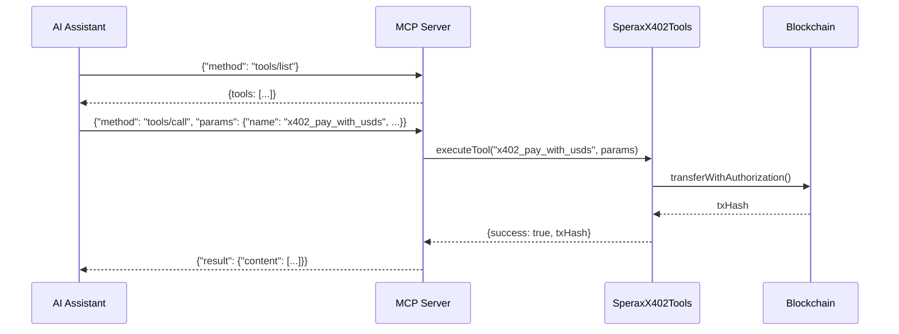

#### Error Propagation

```typescript
async function handleRequest(request: MCPRequest): Promise<MCPResponse> {
  try {
    switch (request.method) {
      case 'tools/call':
        const result = await tools.executeTool(
          request.params?.name as string,
          request.params?.arguments as Record<string, unknown>
        );
        return {
          jsonrpc: '2.0',
          id: request.id,
          result: { content: [{ type: 'text', text: JSON.stringify(result) }] }
        };
      // ...
    }
  } catch (error) {
    return {
      jsonrpc: '2.0',
      id: request.id,
      error: {
        code: -32000,  // Server error
        message: error instanceof Error ? error.message : 'Unknown error',
      }
    };
  }
}
```

---

## Security Model

### Threat Model

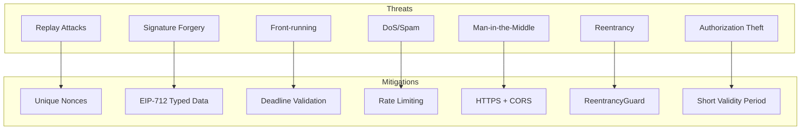

### Trust Assumptions

| Component | Trust Level | Assumption |
|-----------|-------------|------------|
| Arbitrum Network | High | L2 sequencer is honest, inherits Ethereum security |
| USDs Token | High | Sperax protocol is secure, audited |
| Facilitator | Medium | Can be self-hosted; doesn't hold funds |
| AI Agent | Low | Untrusted; must provide valid signatures |
| API Server | Low | Only verifies payments; no custody |

### Key Management

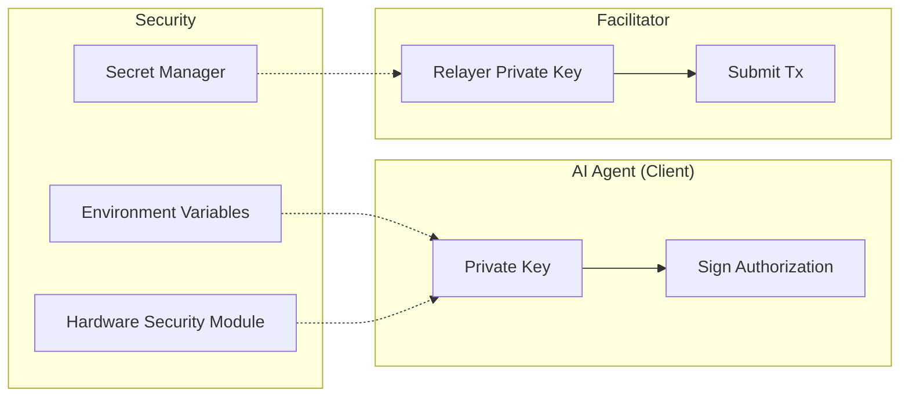

**Best Practices:**
1. Never store private keys in code
2. Use environment variables or secret managers
3. Rotate facilitator keys periodically
4. Consider HSM for high-value operations
5. Implement key derivation for multiple agents

### Signature Verification Flow

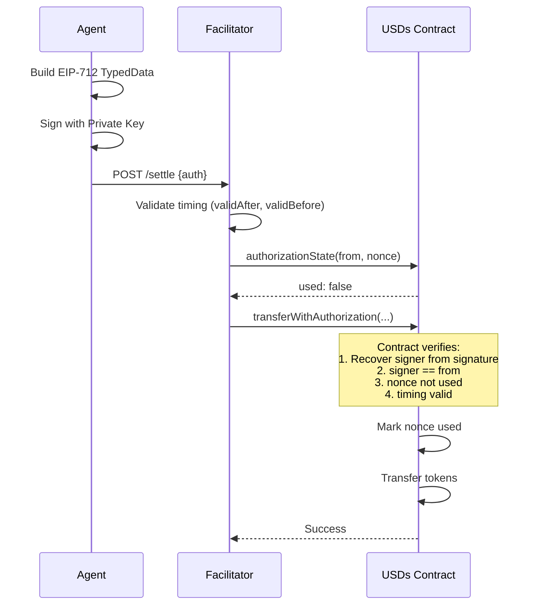

### Rate Limiting Strategy

```typescript
// Global rate limit
const globalLimiter = rateLimit({
  windowMs: 60 * 1000,    // 1 minute
  max: 100,               // 100 requests per minute
  standardHeaders: true,
  legacyHeaders: false,
});

// Stricter limit for settlement (expensive operation)
const settlementLimiter = rateLimit({
  windowMs: 60 * 1000,
  max: 10,                // 10 settlements per minute
  message: { error: 'Too many settlement requests' },
});

// Per-IP tracking with sliding window
const verificationLimiter = rateLimit({
  windowMs: 60 * 1000,
  max: 50,
  keyGenerator: (req) => req.ip || 'unknown',
});
```

### DoS Protection

| Layer | Protection |
|-------|------------|
| Network | CloudFlare/AWS Shield |
| Transport | Connection limits, timeout |
| Application | Rate limiting, payload size limits |
| Blockchain | Gas limits, nonce validation |
| Cache | LRU eviction, TTL expiration |

---

## Design Decisions

### ADR-001: Why USDs?

**Status:** Accepted  
**Date:** 2024-06

**Context:**
We needed a payment token for AI agent micropayments that:
- Has stable value
- Minimizes idle capital loss
- Supports gasless transfers
- Works on L2 for low costs

**Decision:**
Use Sperax USDs as the primary payment token.

**Consequences:**
- ✅ **Yield**: 8-25% APY on idle balances (rebasing)
- ✅ **Gasless**: EIP-3009 transferWithAuthorization support
- ✅ **Stable**: USD-pegged, over-collateralized
- ✅ **Arbitrum native**: Low gas costs (~$0.001)
- ⚠️ **Trade-off**: Less liquid than USDC
- ⚠️ **Trade-off**: Requires rebase opt-in tracking

**Alternatives Considered:**
| Token | Yield | Gasless | Liquidity |
|-------|-------|---------|-----------|
| USDC | 0% | ✅ Permit2 | ⭐⭐⭐⭐⭐ |
| USDT | 0% | ❌ | ⭐⭐⭐⭐ |
| DAI | ~4% (DSR) | ✅ Permit | ⭐⭐⭐⭐ |
| **USDs** | **8-25%** | **✅ EIP-3009** | ⭐⭐⭐ |

---

### ADR-002: Why Arbitrum?

**Status:** Accepted  
**Date:** 2024-06

**Context:**
We needed an L2 network that:
- Has sub-second finality for UX
- Costs < $0.01 per transaction
- Has strong security guarantees
- Supports existing tooling

**Decision:**
Deploy on Arbitrum One (mainnet) and Arbitrum Sepolia (testnet).

**Consequences:**
- ✅ **Cost**: ~$0.001 per transfer
- ✅ **Speed**: ~250ms block time
- ✅ **Security**: Optimistic rollup with fraud proofs
- ✅ **Ecosystem**: Largest L2 TVL, good tooling
- ⚠️ **Trade-off**: 7-day withdrawal to L1
- ⚠️ **Trade-off**: Sequencer centralization risk

**Alternatives Considered:**
| Network | Cost | Speed | Security |
|---------|------|-------|----------|
| Ethereum | $5-50 | 12s | ⭐⭐⭐⭐⭐ |
| **Arbitrum** | **$0.001** | **250ms** | ⭐⭐⭐⭐ |
| Optimism | $0.001 | 2s | ⭐⭐⭐⭐ |
| Base | $0.0005 | 2s | ⭐⭐⭐⭐ |
| Polygon | $0.01 | 2s | ⭐⭐⭐ |

---

### ADR-003: Why EIP-3009?

**Status:** Accepted  
**Date:** 2024-06

**Context:**
AI agents need to make payments without:
- Holding native tokens for gas
- Multiple transactions (approve + transfer)
- Exposing private keys to multiple services

**Decision:**
Use EIP-3009 `transferWithAuthorization` for gasless payments.

**Consequences:**
- ✅ **Gasless**: Payer signs, relayer pays gas
- ✅ **Atomic**: Single transaction
- ✅ **Secure**: Time-limited, nonce-protected
- ✅ **UX**: No ETH required for agents
- ⚠️ **Trade-off**: Not all tokens support it
- ⚠️ **Trade-off**: Requires trusted relayer

**Flow Comparison:**

```
Traditional (3 transactions):
1. Agent: approve(facilitator, amount)
2. Facilitator: transferFrom(agent, recipient, amount)
3. Agent: (hold ETH for gas)

EIP-3009 (1 transaction):
1. Agent: sign(authorization) [off-chain]
2. Facilitator: transferWithAuthorization(auth) [pays gas]
```

---

### ADR-004: UUPS Upgrade Pattern

**Status:** Accepted  
**Date:** 2024-06

**Context:**
Smart contracts need upgradeability for:
- Bug fixes
- Feature additions
- Parameter adjustments

**Decision:**
Use UUPS (Universal Upgradeable Proxy Standard) for all core contracts.

**Consequences:**
- ✅ **Gas efficient**: Upgrade logic in implementation
- ✅ **Simpler**: Single proxy contract
- ✅ **Secure**: OpenZeppelin audited
- ⚠️ **Trade-off**: Owner has significant power
- ⚠️ **Trade-off**: Risk of storage collision

**Mitigation:**
- Storage gaps in all contracts
- Timelock for upgrades (future)
- Multi-sig ownership (recommended)

---

## Scalability Considerations

### Horizontal Scaling Strategies

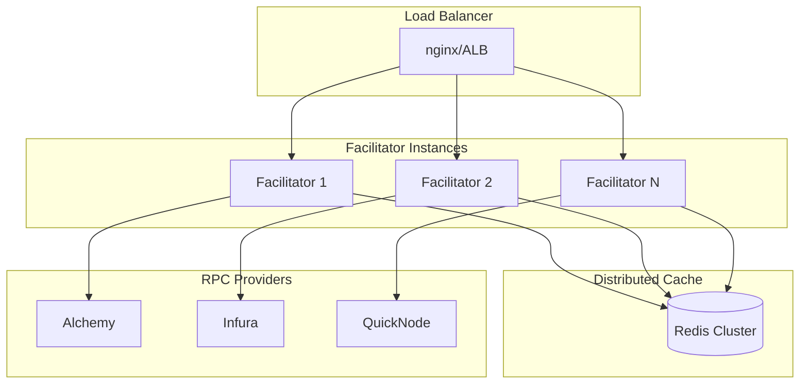

**Key Strategies:**

1. **Stateless Facilitators**
   - All state in Redis/database
   - Any instance can handle any request
   - Easy horizontal scaling

2. **Connection Pooling**
   - Reuse RPC connections
   - Multiple RPC providers for redundancy
   - Load balance across providers

3. **Cache Distribution**
   - Redis Cluster for high availability
   - Consistent hashing for key distribution
   - TTL-based expiration

### Bottleneck Analysis

| Component | Bottleneck | Mitigation |
|-----------|------------|------------|
| RPC Calls | Rate limits, latency | Multiple providers, caching |
| Cache | Memory, network | Redis Cluster, sharding |
| Signature Verification | CPU | Batch verification, caching |
| Database | IOPS, connections | Read replicas, connection pool |
| Settlement | Nonce management | Sequential queue per address |

### Performance Benchmarks

**Target Metrics:**

| Metric | Target | Notes |
|--------|--------|-------|
| Quote latency | < 50ms | Cached pricing |
| Verify latency | < 200ms | With cache hit |
| Settle latency | < 5s | Including block confirmation |
| Throughput | 1000 req/s | Per facilitator instance |
| Cache hit rate | > 90% | For verifications |

**Load Testing Results (simulated):**

```
Endpoint       RPS     P50     P95     P99     Error%
---------      ---     ---     ---     ---     ------
GET /health    5000    2ms     5ms     10ms    0%
POST /quote    2000    10ms    25ms    50ms    0%
POST /verify   1000    50ms    150ms   300ms   0.1%
POST /settle   100     1.5s    3s      5s      0.5%
```

### Future Optimizations

1. **Batch Settlement**
   - Aggregate multiple authorizations
   - Single transaction for multiple payments
   - Gas savings: ~40%

2. **State Channel Precomputes**
   - Pre-sign multiple payment increments
   - Instant off-chain updates
   - Periodic on-chain settlement

3. **Rollup-specific Optimizations**
   - Arbitrum Stylus (Rust contracts)
   - Custom precompiles
   - Blob data for cheaper storage

---

## Appendix

### API Reference

See [API.md](./API.md) for complete endpoint documentation.

### Contract Addresses

| Contract | Arbitrum One | Arbitrum Sepolia |
|----------|--------------|------------------|
| USDs | `0xD74f5255D557944cf7Dd0E45FF521520002D5748` | - |
| ToolRegistry | TBD | TBD |
| PaymentChannel | TBD | TBD |
| Subscription | TBD | TBD |
| CreditSystem | TBD | TBD |

### Glossary

| Term | Definition |
|------|------------|
| **EIP-3009** | Ethereum standard for gasless token transfers via signed authorizations |
| **Facilitator** | Off-chain service that submits signed authorizations on-chain |
| **HTTP 402** | HTTP status code "Payment Required" |
| **MCP** | Model Context Protocol - standard for AI tool integration |
| **Rebasing** | Token mechanism where balance increases automatically (yield) |
| **UUPS** | Universal Upgradeable Proxy Standard |
| **USDs** | Sperax USD - yield-bearing stablecoin |

---

*Document generated for X402 Protocol v1.0.0*
